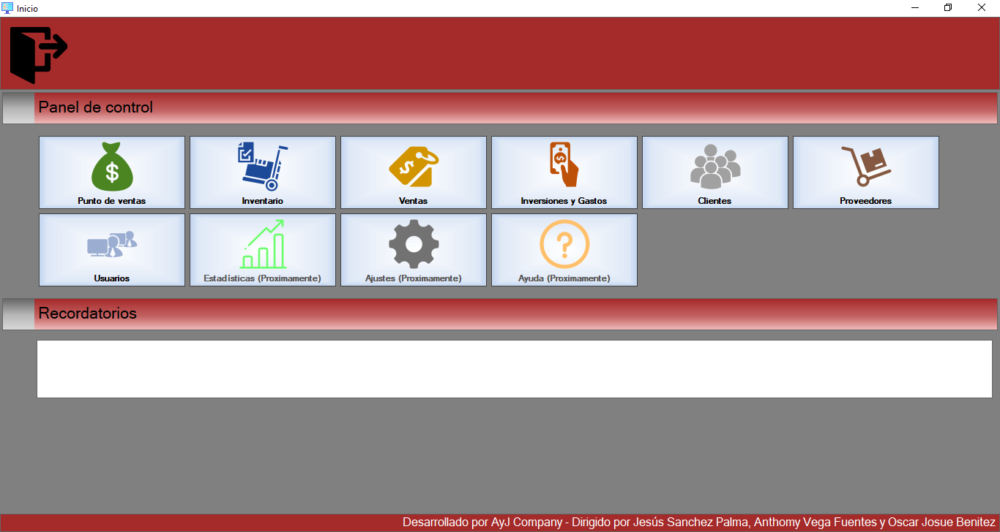
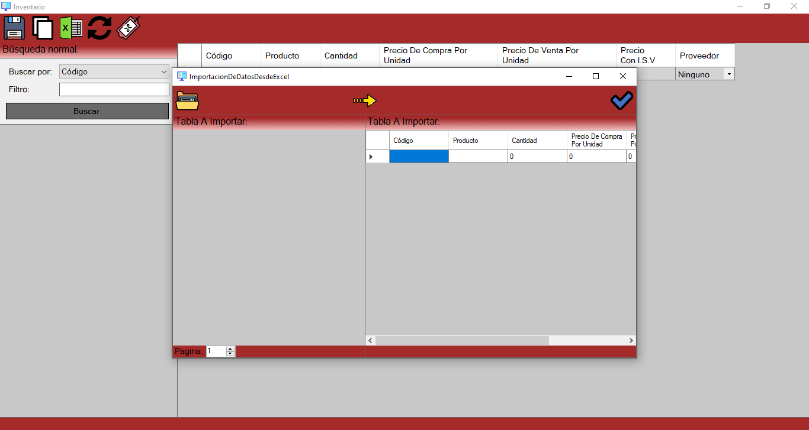
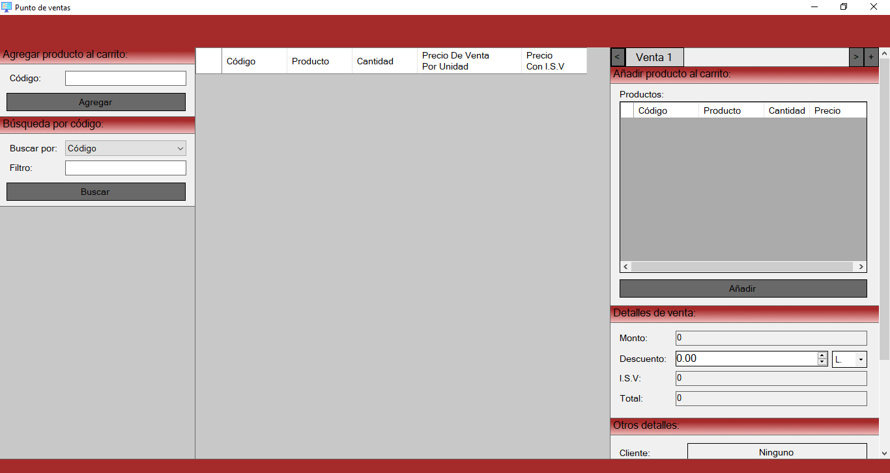

# Software POS Inconcluso

  

## Software description

**[Software POS Inconcluso](https://github.com/JA-Developer/Software-POS-Inconcluso) was a general purpose sales management software developed in the C# programming language many years ago.** Due to the loss of the source code, it was never completed, but it was intended to offer a complete set of tools to manage all aspects related to the administration of a store, including sections such as: "Point of Sales", "Inventory", "Sales", "Expenses", "Customers", "Suppliers", "Users", "Statistics", "Configuration" and "Help".

  

## Sections

The only finished sections are listed below:

<ol>
  <li><b>Point of Sales:</b> It was a user interface that allowed cashiers to create and manage multiple sales at the same time. It included options such as: Customer and invoice number.</li>
  <li><b>Inventory:</b> This section was the most critical part of the program, as it allowed users to create, view, modify and delete products from inventory. In addition, there was a function to help users import product data from Excel files.</li>
  <li><b>Sales:</b> There was a screen displaying all relevant sales information, which users could filter and modify as many times as necessary.</li>
  <li><b>Expenses:</b> The expenses section allowed users to record expenses and purchases, allowing them to keep track of money going out. It also had an option to import information from Excel files.</li>
  <li><b>Customers:</b> Users could create, view, modify and delete customer information stored in the database. This information was required when registering a sale.</li>
  <li><b>Suppliers:</b> The suppliers section offered all the necessary options to register suppliers.</li>
  <li><b>Users:</b> The software allowed users to create, view, modify, and delete user accounts.</li>
</ol>

  

  

## Requirements

The requirements for running the software are:

<ul>
  <li>Windows 7, Windows 8, Windows 8.1, Windows 10 or Windows 11.</li>
  <li>Microsoft Office Access.</li>
</ul>

## Contributing

This software was developed by Jesús Sánchez Palma, with the help of Anthomy Vega and Oscar Benitez.